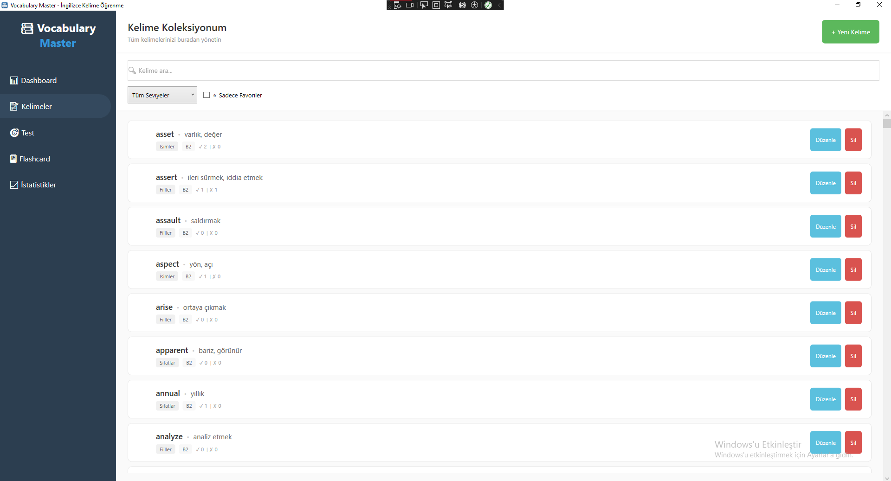

# VocabularyMaster 🎓

VocabularyMaster is a modern desktop application designed to streamline the process of learning English vocabulary. Built with **C#** and **WPF**, it offers a user-friendly interface for managing word lists, practicing, and tracking learning progress.

## 🚀 Features

* **Comprehensive Word Database:** Manage English words with their Turkish meanings effectively.
* **Categorization:** Organize words by categories or difficulty levels for focused learning.
* **Progress Tracking:** Analyze your learning journey with the detailed **Statistics Dashboard**.
* **Persistent Storage:** All data is securely stored locally using **SQLite**, ensuring you never lose your progress.
* **Modern UI:** Clean and responsive user interface built with Windows Presentation Foundation (WPF).

## 🛠️ Technologies Used

* **Language:** C#
* **Framework:** .NET / WPF
* **Database:** SQLite
* **IDE:** Visual Studio

## 📷 Screenshots





    ```
2.  **Open the project:**
    Open `VocabularyMaster.sln` in **Visual Studio**.
3.  **Restore Packages:**
    Ensure NuGet packages (specifically `System.Data.SQLite` or similar) are restored.
4.  **Run:**
    Press `F5` to build and run the application.
